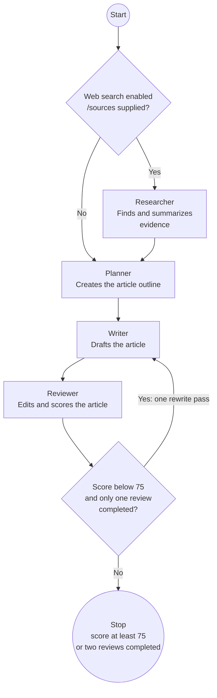

# Agent Pipeline

```mermaid
flowchart TD
    start((Start)) --> researchCheck{Web search enabled<br/>/sources supplied?}
    researchCheck -->|Yes| researcher[Researcher<br/>Finds and summarizes
     evidence]
    researchCheck -->|No| planner[Planner<br/>Creates the article outline]
    researcher --> planner
    planner --> writer[Writer<br/>Drafts the article]
    writer --> reviewer[Reviewer<br/>Edits and scores the article]
    reviewer --> retryCheck{Score below 75<br/>and only one review 
    completed?}
    retryCheck -->|Yes: one rewrite pass| writer
    retryCheck -->|No| finish((Stop<br/>score at least 75 
    or two reviews completed))
```
