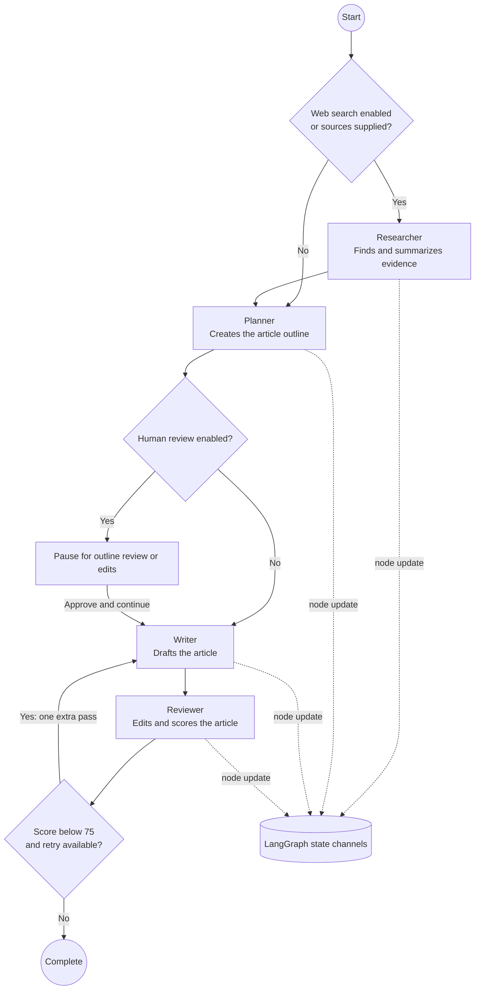

# Agent Pipeline

`buildEditorialGraph()` compiles a LangGraph `StateGraph` that owns node execution, state updates, transitions, the review retry, and human-review pauses. The Express server streams node updates from each graph invocation to the browser over SSE.

The graph starts at the researcher when web search is enabled or sources are supplied; otherwise it starts at the planner. Each node returns a partial state update. When Human in the Loop is enabled, the graph pauses only after the planner creates the outline and before writing begins. The pause node returns the outline, next node, and full state to the browser over SSE. After approval or edits, the browser posts the state and next node to `/api/generate/continue`, which starts a new graph invocation at that node. A score below 75 after review routes to one additional writer/reviewer pass. The app does not configure a persistent LangGraph checkpointer. **Stop generating** aborts an in-flight graph request.
