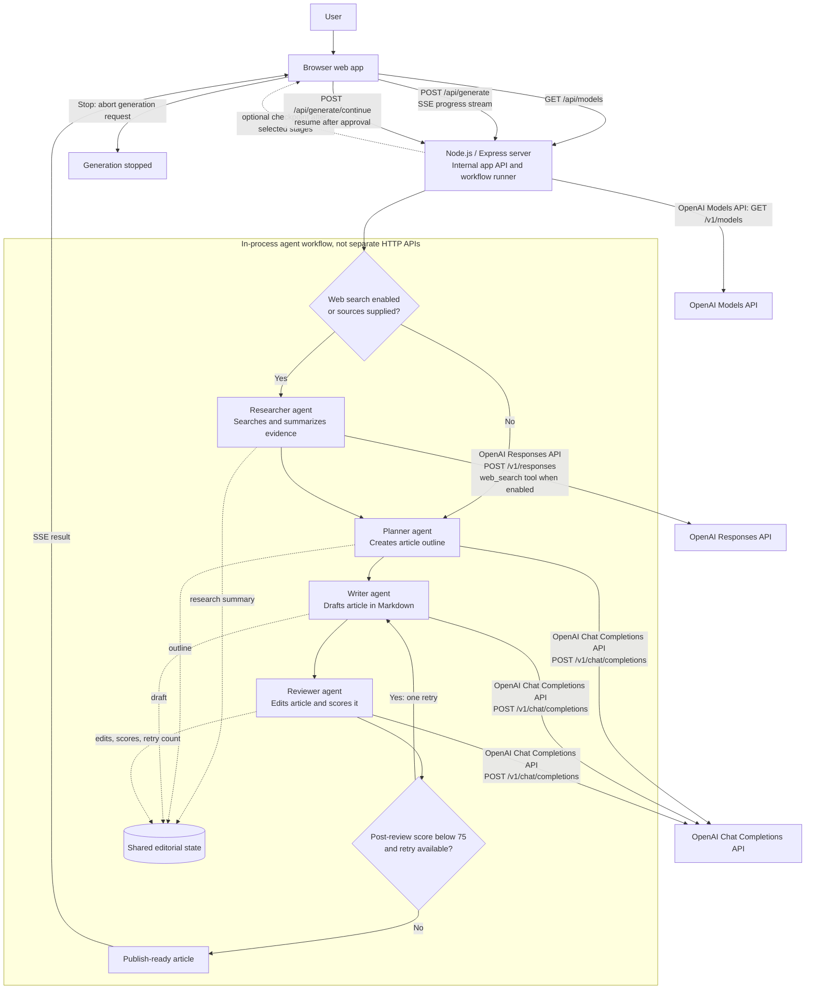

# Agent Architecture

The article generator runs a staged workflow over shared editorial state. The agents are in-process steps in the Node.js server, not separate HTTP services. The browser calls the app's internal routes; the server calls OpenAI APIs for model work. Research is included when web search is enabled or source material is supplied; otherwise the workflow starts with planning. After review, an article scoring below 75 gets one rewrite and re-review pass.

`/api/models`, `/api/generate`, and `/api/generate/continue` are routes served by this app; they are not OpenAI endpoints. Human-in-the-loop checkpoints can be enabled for selected stages. The server pauses after a selected stage and resumes from its next node when the browser posts to `/api/generate/continue`. Stopping aborts the active generation request. The score-based rewrite path is limited to one additional writer/reviewer pass.
