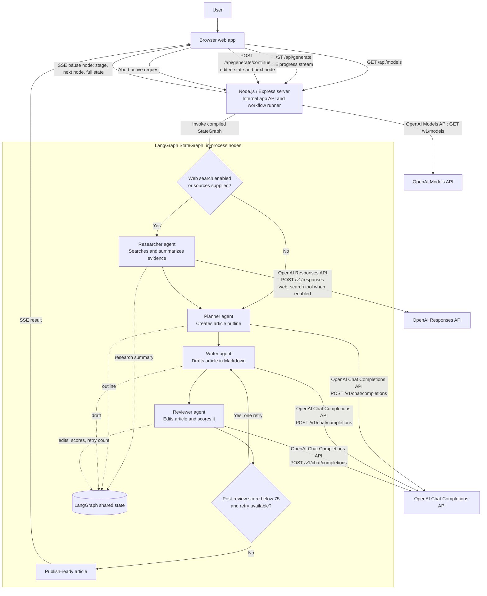

# Agent Architecture

The article generator uses the compiled LangGraph `StateGraph` from `buildEditorialGraph()` in `src/graph.ts` to orchestrate its in-process agent nodes. LangGraph owns the stage transitions, shared state, retry branch, and pause node; LangChain's `ChatOpenAI` provides chat-model integration, while the researcher uses the OpenAI Responses API directly. `runGraph()` in the Express server streams LangGraph node updates to the browser over SSE. Research runs when web search is enabled or source material is supplied; otherwise the graph starts with planning. After review, a score below 75 triggers one additional writing and review pass.

LangGraph state is scoped to a graph invocation. For a selected human-review stage, a LangGraph pause node ends the current invocation and returns the stage, next node, and full state to the browser over SSE. After approval and any edits, the browser posts that state to `/api/generate/continue`; the server starts a new graph invocation at the saved next node. No persistent LangGraph checkpointer is configured.

`/api/models`, `/api/generate`, and `/api/generate/continue` are routes served by this app; they are not OpenAI endpoints. Human-in-the-loop pauses can be enabled for selected stages. The score-based rewrite path is limited to one additional writer/reviewer pass.
