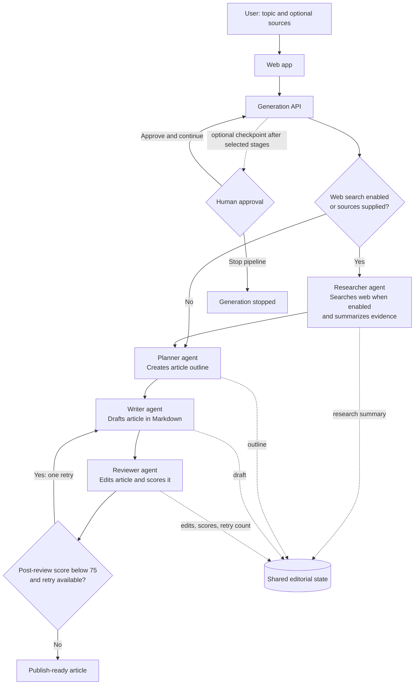

# Agent Architecture

The article generator runs a staged workflow over shared editorial state. Research is included when web search is enabled or source material is supplied; otherwise the workflow starts with planning. After review, an article scoring below 75 gets one rewrite and re-review pass.

Human-in-the-loop checkpoints can be enabled for selected stages. The server pauses after a selected stage and resumes from its next node when approved. The score-based rewrite path is limited to one additional writer/reviewer pass.
